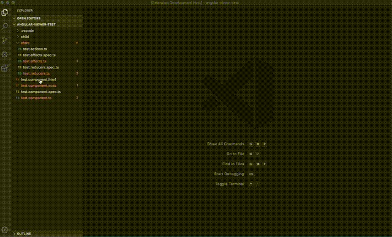

# Angular Viewer

Make browsing the files in your angular/ngrx app easier by automatically opening related angular files in efficient layouts.

This extension will open 3 related files in a 3 pane, mixed horizontally and vertically split layout.

## Features

 - Select `av` from the VSCode command palette to open the directive (.ts), style sheet (.scss) and template (.html) OR effects, reducers and actions files that have the same name as the file in the currently focused window

 

## Extension Settings

 - `angularViewer.leftToRightPercentage` can be used to set the width of the top left pane (relative to the editor window)
 - `angularViewer.topToBottomPercentage` can be used to set the height of the top left pane (relative to the editor window)

 The other panes' dimensions are the compliment of the provided values. These settings can be found in your JSON or WorkBench settings.

## Installation Instructions

Now published under `shupe`

The .vsix binary is included for convenience. To install the extension, 
 - Go to VSCode's Extensions pane
 - Click More Actions `...` menu in the upper right
 - Select "Install from .vsix"
 - Select the .vsix file from the build/ folder

To build from source, install VSCode's publication/packaging utility `npm install -g vsce` and run `vsce package` in the root directory

## Release Notes

### 1.0.0
  - Confirguration options for pane dimensions. Bug fixes.

### 0.2.0
  - Support for ngrx store files - more of that sweet, sweet hardcoded functionality

 ### 0.1.0
  - Initial hardcoded functionality: 3 mixed horizontal/vertical panes

  
